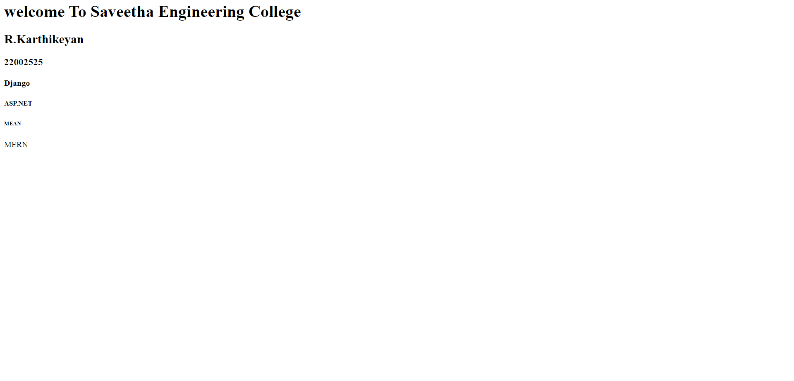

# Developing a Simple Webserver

# AIM:

R.KARTHIKEYAN 22002525

# DESIGN STEPS:

## Step 1:

HTML content creation is done

## Step 2:

Design of webserver workflow

## Step 3:

Implementation using Python code

## Step 4:

Serving the HTML pages.

## Step 5:

Testing the webserver

# PROGRAM:
```
from http.server import HTTPServer, BaseHTTPRequestHandler

content = """
<html>
<head>
</head>
<body>
<h1>welcome</h1> 
<h2>WEBFRAMEWORK</h2>
<h3>NAME:R.KARTHIKEYAN</h3>
<h4>REF.NO:22002525</h4>
<h5>DJANGO</h5>
<h6>ASP.NET</h6>
<h7>SPRING</h7>
<h8>MEAN & MERN</h8>
</body>
</html>

````


# OUTPUT:



# RESULT:

The program is executed succesfully
